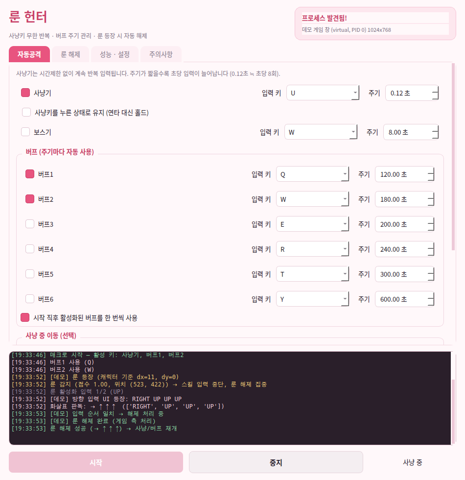
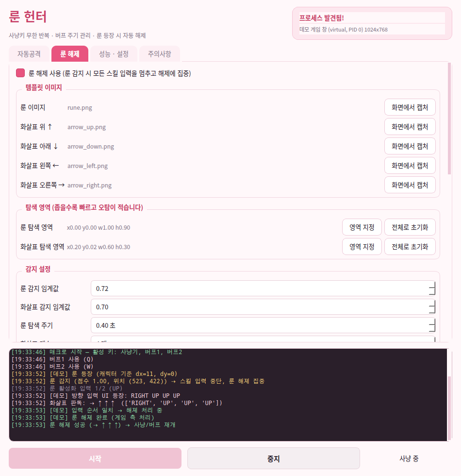
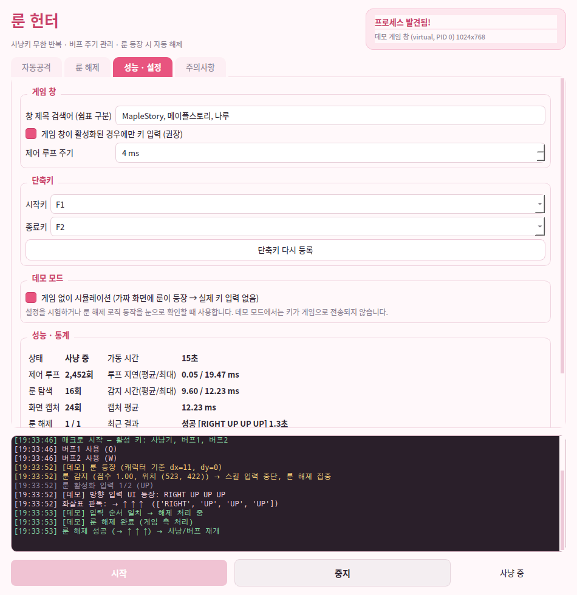

# 룬 헌터 (Rune Hunter)

메이플스토리 계열 **사설 서버**용 사냥 매크로입니다. 창모드로 실행 중인 게임 클라이언트에
키를 주기적으로 넣어주고, **룬이 등장하면 스킬 입력을 멈추고 룬 해제에 집중**했다가
해제가 끝나면 사냥과 밀린 버프를 이어서 진행합니다.

- 사냥기: 시간제한 없이 설정한 주기로 무한 반복 (연타 / 홀드 선택)
- 보스기 + 버프 6종: 각각 사용 키와 주기를 GUI 에서 선택
- 룬 해제: 룬 감지 → 접근(방향키·점프·로프 커넥트) → 활성화 → 화살표 판독 → 방향키 입력 → 해제 확인
- 게임 창이 비활성화되면 자동으로 입력 중단 (실수로 다른 창에 키가 들어가는 것 방지)
- 데모 모드: 게임 없이 가짜 화면으로 전체 로직을 눈으로 확인 (실제 키 입력 없음)

> ⚠️ **책임 고지** — 이 프로그램은 사용자 본인이 책임지고 사용하는 사설 서버 환경의 자동화
> 실험용입니다. 게임 약관 위반, 계정 제재, 그로 인한 모든 손해의 책임은 사용자에게 있습니다.
> 상용 서비스나 타인의 서버에서 사용하지 마세요.



<details>
<summary>룬 해제 탭 / 성능·설정 탭 화면</summary>




</details>

## 1. 설치 (Windows)

프로젝트를 `C:\code\rune-hunter` 같은 경로에 두고 시작합니다.

```bat
cd C:\code
git clone <이 저장소 주소> rune-hunter
cd rune-hunter
run.bat
```

`run.bat` 이 처음 실행될 때 가상환경(`.venv`)을 만들고 필요한 모듈을 자동으로 설치합니다.

- 필요 모듈: `PySide6`(GUI), `opencv-python-headless`(이미지 인식), `numpy`, `mss`(화면 캡처)
- 파이썬 3.10 이상 필요 (권장 3.11/3.12, 64비트)
- 실행 시 UAC 창이 뜨면 **예**를 눌러 관리자 권한으로 승격합니다.
  게임이 관리자 권한으로 돌고 있으면 매크로도 같은 권한이어야 키 입력이 전달됩니다.

수동으로 설치하려면:

```bat
py -3 -m venv .venv
.venv\Scripts\python -m pip install -e .
.venv\Scripts\python -m rune_hunter
```

게임 없이 동작만 먼저 보고 싶으면 `run_demo.bat` (또는 `python -m rune_hunter --demo`).

## 2. 첫 설정 순서

1. **게임을 창모드로 실행**합니다. 창 크기는 이후 바꾸지 않는 편이 좋습니다.
2. 룬 헌터를 실행하면 오른쪽 위 카드에 `프로세스 발견됨! <창 제목> (프로세스명, PID)` 이 표시됩니다.
   표시되지 않으면 `성능 · 설정` 탭의 **창 제목 검색어**에 실제 창 제목의 일부를 넣으세요
   (기본값: `MapleStory, 메이플스토리, 나루`).
3. `자동공격` 탭에서 사냥기 / 보스기 / 버프의 **키와 주기**를 고릅니다.
4. `룬 해제` 탭에서 **템플릿 이미지 5장**을 만듭니다 (아래 3번 항목).
5. `성능 · 설정` 탭에서 **데모 모드**를 켜고 시작해 로직을 확인한 뒤, 끄고 실전에 사용합니다.
6. 시작 `F1` / 정지 `F2` (단축키는 변경 가능). 게임 창이 활성화된 상태에서도 동작합니다.

## 3. 룬 해제 설정 (가장 중요)

룬 해제는 이미지 인식 기반입니다. **본인 서버의 실제 화면**으로 만든 템플릿이 있어야 정확합니다.

1. `룬 해제` 탭 → 각 항목의 `화면에서 캡처` 버튼 → 현재 게임 화면에서 해당 부분만 드래그.
   - `룬 이미지`: 맵에 떠 있는 룬
   - `화살표 위/아래/왼쪽/오른쪽`: 룬을 활성화했을 때 화면 상단에 뜨는 방향 화살표
     (룬을 하나 띄워 놓고 캡처하면 편합니다)
2. `탐색 영역`을 좁게 지정합니다. 화살표는 보통 화면 상단 중앙이라 이 영역만 지정하면
   속도와 정확도가 함께 올라갑니다.
3. `지금 화면에서 룬 감지 테스트` / `화살표 판독 테스트` 버튼으로 즉시 확인합니다.
   로그에 `룬 감지 성공 — 점수 0.93, 위치 (612, 388), 3.1ms` 처럼 점수와 소요 시간이 남습니다.
   - 점수가 임계값보다 낮게 나오면 임계값을 조금 내리거나 템플릿을 다시 캡처하세요.
   - 룬이 없는데 감지되면(오탐) 임계값을 올리거나 탐색 영역을 좁히세요.

### 해제 동작 흐름

| 단계 | 하는 일 | 관련 설정 |
| --- | --- | --- |
| 감지 | 룬 템플릿을 찾으면 즉시 모든 스킬 입력 중단 | 룬 감지 임계값, 룬 탐색 주기 |
| 접근 | 룬과 캐릭터의 x 차이를 보고 방향키를 눌러 이동. 룬이 위에 있으면 로프 커넥트(A), 아래에 있으면 아래 방향키+점프(ALT) | 좌우 허용 오차, 이동 환산 계수, 높이 차 허용, 접근 제한 시간 |
| 활성화 | 룬 앞에서 위 방향키 입력, 화살표 UI 가 뜨는지 확인 | 룬 활성화 키, 활성화 시도 횟수 |
| 판독 | 화살표 4개를 매칭해 x 좌표 순으로 정렬. 같은 결과가 연속 N번 나오면 확정 | 화살표 감지 임계값, 판독 확정 프레임 |
| 입력 | 판독한 순서대로 방향키 입력 | 화살표 키 누름 시간, 화살표 입력 간격 |
| 확인 | 화살표 UI 가 사라지면 성공. 남아 있으면 다시 판독해서 재시도 | 해제 확인 대기, 재시도 횟수 |
| 재개 | 사냥키를 다시 반복 입력하고, 해제 중에 주기가 지난 버프를 이어서 사용 | 성공/실패 후 재탐색 대기 |

접근 동작이 불안하면 `접근 동작 사용`을 끄고, 룬 근처에서 매크로를 시작하는 방식으로도 쓸 수 있습니다.
(그 경우 룬이 화면에 보이면 바로 활성화를 시도합니다.)

## 4. 성능

이 VM(합성 1024x768 화면) 기준 측정값입니다. `python -m rune_hunter.tools.bench` 로 직접 측정할 수 있고,
`--live` 옵션을 주면 실제 게임 창을 캡처해서 측정합니다.

| 항목 | 1회 소요 |
| --- | --- |
| 룬 감지 (전체 화면) | 평균 8.0 ms |
| 룬 감지 (감지 축소 0.5배) | 평균 2.1 ms |
| 룬 감지 (탐색 영역 축소) | 평균 3.1 ms |
| 화살표 4개 판독 | 평균 5.9 ms |
| 정밀 대기 오차 (5/20/120 ms 목표) | 0.01 ms 이하 |

기본 설정은 룬 탐색을 0.6초에 한 번만 하므로, 감지에 8ms 가 걸려도 CPU 점유는 1~2% 수준입니다.
더 빠르게 하려면 순서대로 시도하세요.

1. `탐색 영역`을 좁힌다 (가장 효과적이고 오탐도 줄어든다)
2. `감지 축소 배율`을 0.5~0.7 로 낮춘다
3. `룬 탐색 주기`를 늘린다 (0.6 → 1.0초)

설계상 성능·안정성 관련 결정:

- **제어 스레드 1개**가 키 입력 스케줄과 룬 탐색·해제를 모두 담당합니다. 스레드 간 상태 공유가
  없으므로 "룬 해제 중에 사냥키가 나가는" 종류의 경합 버그가 원천적으로 생기지 않습니다.
- 키 입력은 **SendInput + 스캔코드**로 보냅니다. DirectInput/RawInput 으로 키를 읽는
  클라이언트는 가상키(keybd_event) 입력을 무시하는 경우가 많습니다. 방향키는 확장 플래그를 붙입니다.
- Windows 에서는 `timeBeginPeriod(1)` 로 타이머 해상도를 1ms 로 올리고, 남은 대기가 1.5ms
  미만이면 스핀 대기로 마무리해 주기 오차를 줄입니다.
- 스킬 다음 사용 시각은 **원래 예정 시각 기준**으로 잡습니다(`next += interval`). 매번 현재
  시각에 더하면 루프 지연이 누적되어 실제 주기가 느려집니다.
- 템플릿은 (경로, 수정시각) 기준으로 캐시하고, 매칭은 그레이스케일 + 지정 영역에서만 수행합니다.
- 오래 멈췄다가 재개해도 밀린 횟수를 몰아서 연타하지 않습니다(버프는 1회만 보충).

## 5. 테스트

```bash
python -m pytest                 # 전체 (약 30초)
python -m pytest -m "not bench"  # 성능 측정 테스트 제외
```

게임 없이 검증할 수 있도록, 키 입력에 반응하는 **가짜 게임 세계**(`rune_hunter/demo.py`)를 만들어
테스트에 사용합니다. 룬이 등장하고, 방향키를 누른 시간만큼 캐릭터가 이동하고, 위 방향키를 누르면
화살표가 뜨고, 순서를 맞추면 해제되는 규칙을 그대로 구현했습니다.

주요 검증 항목:

| 파일 | 검증 내용 |
| --- | --- |
| `tests/test_engine.py` | **룬 해제 중 스킬 키가 단 한 번도 나가지 않음**, 해제 후 사냥·버프 재개, 창 미발견/비활성 시 무입력, 홀드 모드 해제, 제어 루프가 CPU 를 태우지 않음 |
| `tests/test_rune_solver.py` | 접근(좌우 이동·로프·아래점프), 판독 순서 정확도, 재시도 후 실패 처리(무한 대기 금지), 종료 시 키 해제 |
| `tests/test_vision.py` | 룬 감지 정확도/오탐 없음, 화살표 5가지 순서, 노이즈 내성, 탐색 영역 제한, 축소 배율의 정확도·속도 |
| `tests/test_scheduler.py` | 사냥키 1분간 반복 횟수, 버프 주기 준수, 우선순위(버프 > 보스기 > 사냥기), 정지 후 밀린 버프 1회 보충 |
| `tests/test_inputs.py` | 스캔코드/확장 플래그 계산, 아래점프 조합 순서, 모든 키 해제 |
| `tests/test_config.py` | 프로필 저장·불러오기, 일부 필드만 있는 예전 프로필 호환 |
| `tests/test_gui_smoke.py` | GUI 생성 → 설정 수집 → 저장, 데모 모드 시작 |

## 6. 문제 해결

| 증상 | 확인할 것 |
| --- | --- |
| 키가 게임에 전혀 안 들어감 | 관리자 권한으로 실행했는지, 게임 창이 활성화되어 있는지. 로그에 `SendInput 실패` 가 있는지 |
| 창을 못 찾음 | `창 제목 검색어`가 실제 창 제목의 일부와 일치하는지 (작업 관리자에서 확인) |
| 룬을 못 찾음 | `룬 감지 테스트` 의 점수 확인 → 임계값을 0.6 근처까지 낮추거나 템플릿 재캡처. 해상도를 바꿨다면 템플릿을 다시 만들어야 함 |
| 화살표를 2~3개만 인식 | 화살표 템플릿을 더 정확히 잘라내기, `화살표 감지 임계값` 낮추기, 탐색 영역이 4개를 모두 포함하는지 확인 |
| 룬 해제만 실패함 | `화살표 입력 간격`을 0.2초 이상으로 늘려보기 (서버 반응이 느린 경우), `판독 확정 프레임`을 2~3 으로 |
| 접근 중 엉뚱하게 이동 | `이동 환산 계수`(ms/px) 를 캐릭터 이동 속도에 맞게 조정, 또는 접근 동작 끄기 |
| 사냥 주기가 설정보다 느림 | `제어 루프 주기`를 4ms 이하로, 다른 무거운 프로그램 종료. `성능 · 설정` 탭의 루프 지연 값 확인 |

## 7. 구조

```
src/rune_hunter/
├─ app.py                  실행 진입점 (관리자 승격, GUI/헤드리스 선택)
├─ config.py               설정 모델 + JSON 프로필 저장·불러오기
├─ keys.py                 키 이름 ↔ 스캔코드/가상키 표
├─ hotkeys.py              전역 단축키 (F1/F2)
├─ demo.py                 가짜 게임 세계 (테스트·데모)
├─ logging_bus.py          스레드 안전 로그 버스 + 파일 로그
├─ platform_layer/         관리자 권한, 정밀 타이머, 게임 창 찾기
├─ inputs/                 SendInput(스캔코드) 백엔드 / 기록용 백엔드
├─ capture/                mss 화면 캡처 (스레드별 인스턴스)
├─ vision/                 템플릿 매칭, 룬·화살표 인식, 합성 이미지 생성
├─ engine/                 스킬 스케줄러, 룬 해제 상태머신, 제어 루프
├─ gui/                    PySide6 화면, 영역 선택 대화상자, 테마
└─ tools/                  성능 측정, 데모 템플릿 생성
```

설정은 `profiles/default.json` 에 저장되고, 로그는 `logs/rune_hunter.log` 에 남습니다.
